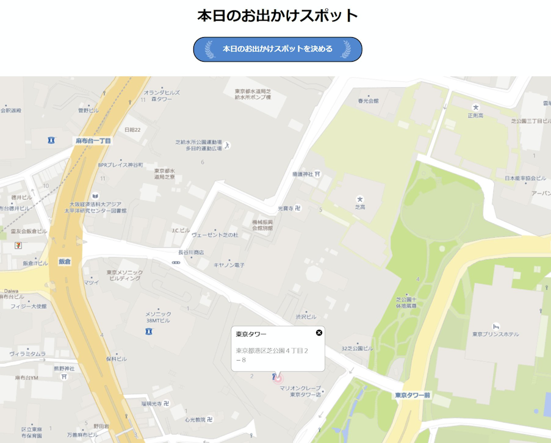

# 課題05 API：本日のお出かけスポット

 

## ①課題内容（どんな作品か）
- 訪れるべきお出かけスポットをChatGPT APIとBing Maps APIを活用して教えてくれるサービスです！

## ②工夫した点・こだわった点
- ランダム性と対象地域を絞り込むために、住所データベース（今回は東京都のみ）からランダムで住所を選択し、付近のお出かけスポットをChat GPTに教えてもらえるようにしました。
- ChatGPTにお出かけスポットの緯度経度もセットで教えてもらいBing Mapsに表示します。

## ③難しかった点・次回トライしたいこと(又は機能)
- お出かけスポットの写真も自動で抽出してBing Maps上に表示したい。

## ④質問・疑問・感想、シェアしたいこと等なんでも
参考サイト
- [BingMaps GO!](https://mapapi.org/)
- [HTMLとJavaScriptでChatGPT APIを使いたい人が参考にする記事はこちら](https://qiita.com/chiiirotty/items/370a92883f8579fc1380)
- [郵便番号データダウンロード](https://www.post.japanpost.jp/zipcode/dl/kogaki-zip.html)

